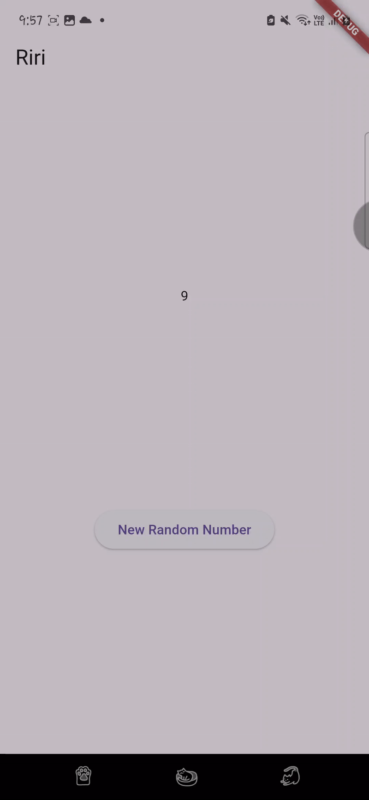
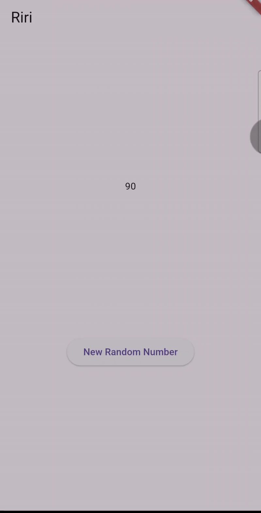

# StateManagement_Streams

soal 3
1. Jelaskan fungsi keyword yield pada kode tersebut!
yield dalam kode itu digunakan untuk menghasilkan atau menyambungkan semua nilai yang dihasilkan oleh Stream.periodic. Jadi, alih-alih menghasilkan satu nilai saja, yield akan meneruskan semua data dari Stream.periodic ke luar seolah-olah itu berasal langsung dari fungsi utama.

2. Apa maksud isi perintah kode tersebut?
Perintah kode tersebut membuat stream yang akan mengeluarkan satu warna dari list colors setiap satu detik. Caranya, fungsi Stream.periodic dijalankan tiap detik, dan di setiap detik ke-t, ia mengambil warna dari list colors berdasarkan indeks t % colors.length.

soal 4 

soal 5 
Jelaskan perbedaan menggunakan listen dan await for (langkah 9) !
Perbedaan antara listen dan await for terletak pada cara mereka menerima data dari stream. Jadi listen menggunakan pendekatan callback, jadi setiap kali ada data baru, fungsi yang diberikan akan langsung dijalankan. Sedangkan await for digunakan dalam fungsi async dan akan menunggu setiap data baru secara berurutan.

soal 6 
Pada langkah 8 dan, kita menggunakan initState() untuk mulai mendengarkan (listen) aliran data dari numberStream, sehingga setiap angka baru yang masuk akan langsung ditampilkan di aplikasi. Sementara di langkah 10, kita membuat fungsi addRandomNumber() yang akan mengambil angka acak dari 0 sampai 9, lalu memasukkannya ke dalam stream menggunakan addNumberToSink(). Jadi, setiap kali tombol ditekan, angka acak dikirim ke stream dan otomatis tampil di layar.

soal 7
langkah 13 ini Kita membuat method addErrorToSink() di dalam class NumberStream, fungsinya adalah untuk mengirimkan error ke dalam stream, bukan data biasa. Ini berguna jika kita ingin memberitahu UI bahwa terjadi kesalahan. 
pada langkah 14 kita menambahkan fungsi onError di initState() agar saat stream menerima error, aplikasi bisa menampilkan pesan error tersebut ke konsol. Ini membantu kita menangani error dengan cara yang lebih baik, bukan membiarkannya terjadi tanpa diketahui. 
pada langkah 15 kita mengganti pengiriman angka acak menjadi pengiriman error menggunakan addError() supaya bisa melihat cara stream menangani error.

soal 8 
pada langkah 1 kita menambahkan sebuah variabel baru bernama Streamtransformer dalam class _StreamHomePageState. Variabel ini digunakan untuk menyimpan stream baru hasil dari manipulasi (transformasi) stream sebelumnya, jadi data yang akan kita tampilkan nanti sudah diproses terlebih dahulu.
pada langkah 2 kita menggunakan method listen() untuk mulai menerima data dari stream. Tapi sebelum ditambahkan ke tampilan, data angka itu dimodifikasi dulu dengan mengalikan angka aslinya dengan 10, dan hanya angka yang merupakan kelipatan 20 yang dimasukkan ke transformer. 
pada langkah 3 kita masih di dalam initState, setelah proses transformasi data selesai, kita memanggil setState() agar UI otomatis diperbarui setiap kali ada data baru yang masuk ke list. Jadi, setiap angka hasil transformasi yang memenuhi syarat akan langsung terlihat di aplikasi. Dengan begitu, kita akan melihat list angka yang hanya kelipatan 20 dari hasil perkalian angka acak dengan 10.

